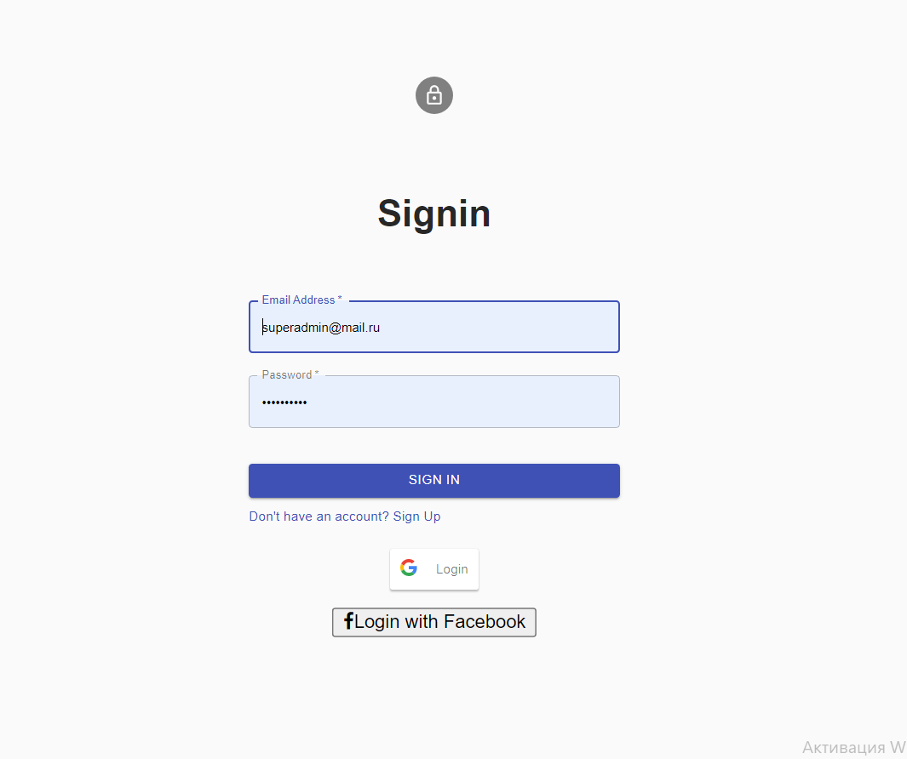
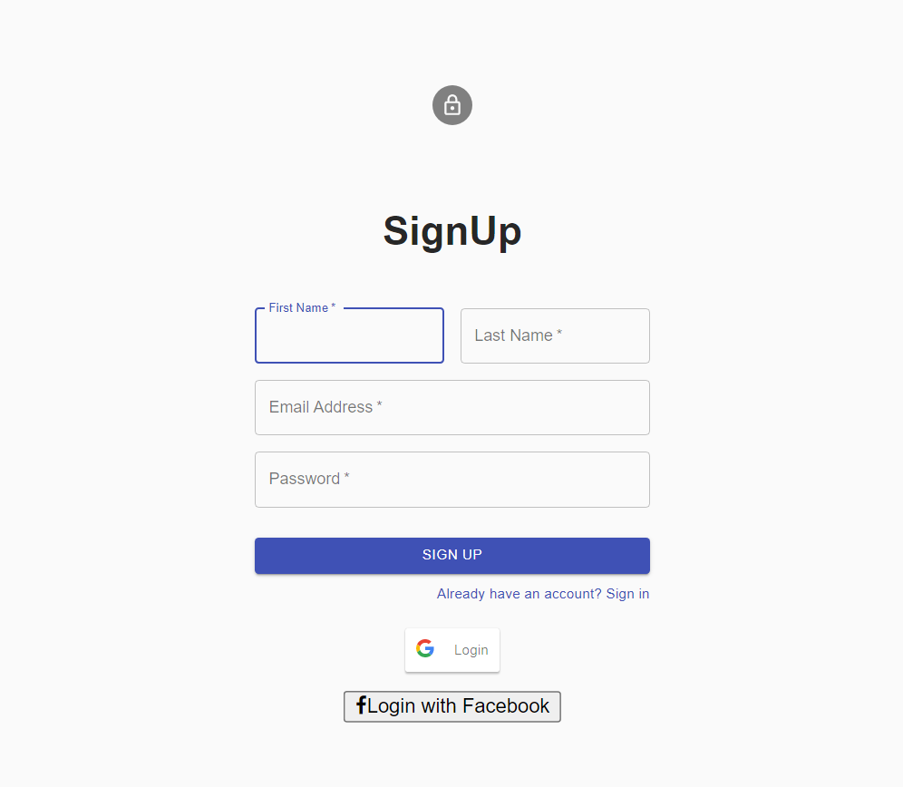
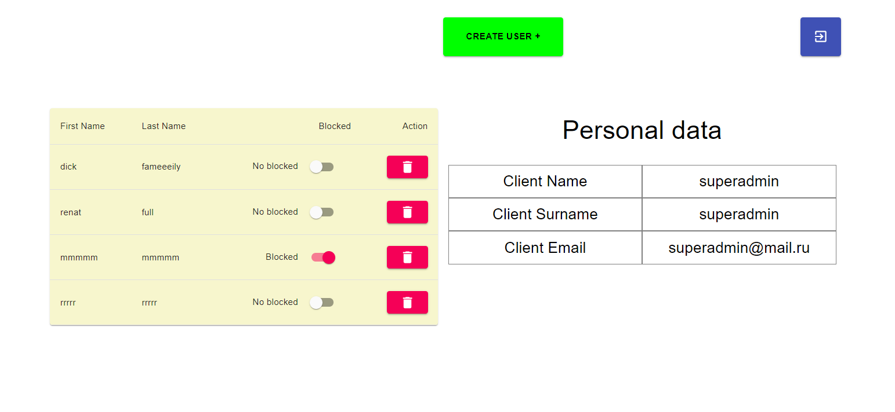
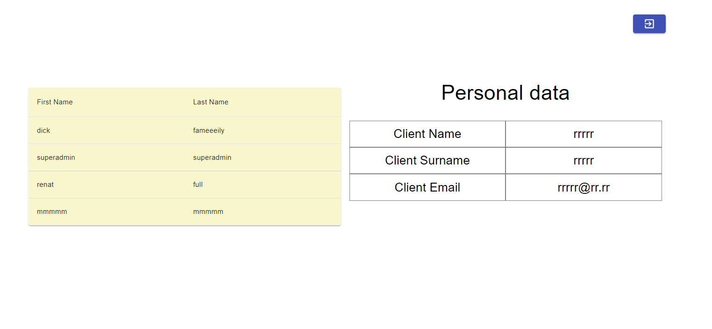
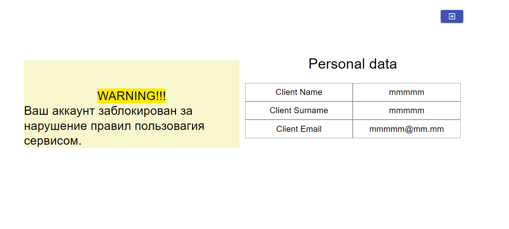

# DevIT_test2_react_fullstack_app


Тестовое задание DevIT. Разработка fullstack приложения для регистрации и управления пользователями
___
## Quick start

Клонируем репозиторий в пустую папку 
``` bash
$ git clone https://github.com/SologubovMaksim2016/DevIT_test2_react_fullstack_app.git
```
Из консоли переходим в клонированную папку
``` bash
$ cd DevIT_test2_react_fullstack_app
```


```проверка версии node.js:```
``` bach
$ node –v  
```

Если node.js на компъютере не установлена, устанавливаем  стабильную версию с сайта  [Nodejs.org](https://nodejs.org/en/)

Команды в консоли:

```проверка версии npm:```
``` bach
$ npm –v  
```
```Для установки зависимостей проекта запускаем поочередно для клиента и сервера выполняем ряд  команд```

``` bach
$ cd client
```
``` bach
$ npm install  
```
(дожидаемся завершения установки)
``` bach
$ cd ..
```
``` bach
$ cd server
```
``` bach
$ npm install  
```
(дожидаемся завершения установки)


```для  запуска тестового задания```
``` bach
$ npm start 
```

Переходим в браузере по адресу http://localhost:3000/

Сервер приложения запускается по адресу http://localhost:5000/

Для запуска документации http://localhost:5000/api-docs/#/

## При выполненнии тестового задания использовались:
``` javascript
- JavaScript
- Node
- NPM
- HTML
- CSS
- MongoDB
- Swagger
- Google Authorization
- Facebook Authorization
- React-Redux
- Redux-thunk
- Material-ui
``` 


## Author

**Maksim Sologubov**

- [Profile](https://github.com/rohit19060 "Rohit jain")
- [Email](mailto:sologubovmaksim2016@gmail.com?subject=Hi "Hi!")
- [Linkedin](https://linkedin.com/in/maksimsologubov "Welcome")
- [CV](http://cvmkr.com/KQFg "My CV")

## Login form

## Registration form

## Admin panel

## User panel

## Blocked user panel


## License
[MIT](https://choosealicense.com/licenses/mit/)
